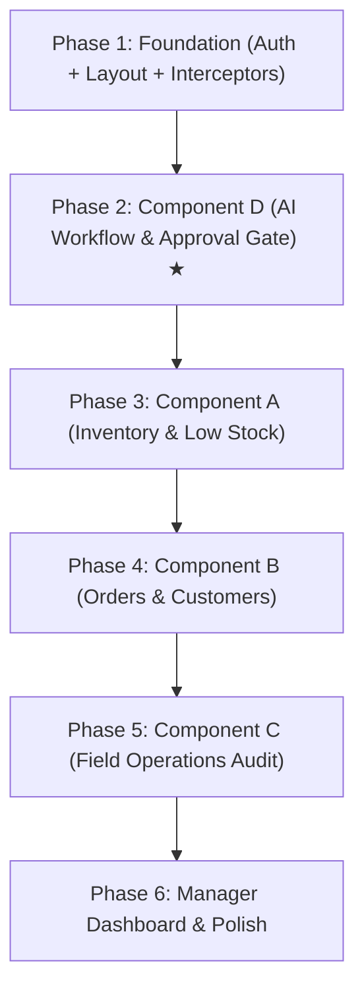

# StockFlow-AI Frontend Architecture Plan
## React Web Application — Complete Implementation Specification (SE3090 SME Inventory & Field-Ops)

**Project**: SE3090 Distributed Systems & SME Inventory Management  
**Architecture**: Component-Wise Modular Dashboard System  
**Framework**: React 18+ (Vite) + TailwindCSS + Axios + TanStack Query  
**Backend API Target**: `http://localhost:5150/api` (Live ASP.NET Core Web API + PostgreSQL)  
**Date**: September 2026  

---

## 📋 Executive Summary & Project Brief Alignment

This architecture plan specifies the complete design and implementation strategy for the **StockFlow-AI React Web Frontend**. It aligns 100% with the **SE3090 SME Inventory & Field Operations Project Brief**, emphasizing clear component-level student ownership, strict role-based access control, production-ready workflows, and the **Human-in-the-Loop Agentic AI Reorder Pipeline**.

### Core Architecture Philosophy: **Component-Wise Architecture**
Rather than confusing student-numbered folders or a single monolithic dashboard, the frontend is organized cleanly by business domain components (`inventory`, `orders`, `field`, `agent`, `dashboard`). Each component maps directly to project brief deliverables, making grading, ownership verification, and viva presentations seamless.

```
StockFlow-AI Frontend (React Web)
│
├── Shared Infrastructure (Common Across All Roles)
│   ├── Authentication, JWT Bearer Interceptors & Session Management
│   ├── Role-Based Route Protection (Admin, Manager, Storekeeper, FieldSales)
│   ├── Professional Responsive Layout (Collapsible Sidebar + Topbar)
│   ├── Unified UI Component Library (Tables, Modals, Badges, KPI Cards, Stat Grids)
│   └── Typed API Service Layer (Axios client with automatic token attachment)
│
├── Component A: Inventory & Stock Module (Student 1 Domain)
│   ├── Product Catalogue Management (CRUD, SKU lookup, Barcode)
│   ├── Real-Time Stock Level Monitor (On-hand, Reserved, Available)
│   ├── Stock Movements History (Sales, Receipts, Transfers, Adjustments)
│   ├── Low-Stock Alert Monitor
│   └── Reorder Threshold Configuration
│
├── Component B: Orders & Customer Desk (Student 2 Domain)
│   ├── Sales Order Desk (Filter by status, customer, date)
│   ├── Order Creation & Multi-Line Item Configuration
│   ├── Order Status Lifecycle Transitions (Pending → Confirmed → Dispatched → Fulfilled / Cancelled)
│   ├── Customer Management & Geocoded Delivery Locations
│   └── Payment Reference Tracking
│
├── Component C: Field Operations & Device Audit (Student 3 Domain)
│   ├── Field Agent Directory & Duty Status
│   ├── Customer Visit Logs & Route Verification
│   ├── Barcode/QR Device Capture Audit Log (Admin verification)
│   ├── Offline Sync Queue Monitoring
│   └── (Optional) Simple Map View (Leaflet GPS Pinpoints)
│
├── Component D: AI Multi-Agent Workflow & Orchestration (Student 4 Domain) ★ HIGHEST PRIORITY
│   ├── 5-Agent Execution Pipeline Monitor & Visual Step Timeline
│   ├── Reorder Proposals Queue (Quantity, Justification, Cost, Confidence %)
│   ├── Human-in-the-Loop Approval Gate (Approve / Reject / Revise with Manager Notes)
│   ├── Multi-Agent Validation Checklist (Schema & Business Rule Checks)
│   └── Allow-listed Tool Call Audit Logs (Inputs, Outputs, Execution Durations)
│
└── Manager Executive Dashboard (Integrated Cross-Component View)
    ├── Real-Time Operational KPI Metrics
    ├── Urgent Pending Approvals Banner
    ├── Critical Stock Warnings
    └── Notification Center (SMS & Email Audit Log)
```

---

## 👥 Student Component & Ownership Matrix

| Component | Student Domain | Primary Responsibilities & Deliverables | Core Pages / Features |
|---|---|---|---|
| **A** | **Student 1** | Inventory management, product master data, threshold alerts, stock velocity | `/inventory/products`, `/inventory/stock`, `/inventory/movements`, `/inventory/thresholds` |
| **B** | **Student 2** | Order desk, customer CRM, status lifecycle transitions, order fulfillment | `/orders`, `/orders/:id`, `/orders/new`, `/customers` |
| **C** | **Student 3** | Field agent supervision, visit history, barcode/QR scan audits, offline sync logs | `/field/agents`, `/field/visits`, `/field/captures`, `/field/sync-queue` |
| **D** | **Student 4** ★ | Multi-agent AI workflow monitoring, reorder proposal generation, approval gate | `/agent/workflows`, `/agent/workflows/:id`, `/agent/proposals`, `/agent/approvals` |
| **Executive** | **Shared / Manager** | Cross-cutting overview, system health, role security, notification audit | `/dashboard`, `/reports`, `/notifications` |

---

## 📁 Recommended Folder Structure

```
frontend-web/
├── public/
│   ├── favicon.ico
│   └── stockflow-logo.svg
│
├── src/
│   ├── assets/
│   │   └── images/
│   │
│   ├── components/
│   │   ├── common/                 # Reusable Design System UI
│   │   │   ├── Button.jsx
│   │   │   ├── DataTable.jsx       # Universal sorting, filtering & pagination
│   │   │   ├── Card.jsx
│   │   │   ├── Modal.jsx
│   │   │   ├── Badge.jsx           # Status badges (Pending, Approved, Low, InStock)
│   │   │   ├── Input.jsx
│   │   │   ├── Select.jsx
│   │   │   ├── StatCard.jsx        # Standard KPI Metric card
│   │   │   ├── LoadingSpinner.jsx
│   │   │   └── EmptyState.jsx
│   │   │
│   │   ├── layout/                 # Application Shell
│   │   │   ├── AppLayout.jsx       # Main container with Sidebar & Header
│   │   │   ├── Sidebar.jsx         # Role-aware navigation links
│   │   │   ├── Header.jsx          # User profile, quick actions & alerts
│   │   │   └── NotificationBell.jsx# Real-time alert notifications popup
│   │   │
│   │   └── feedback/
│   │       ├── Toast.jsx
│   │       └── ConfirmDialog.jsx
│   │
│   ├── features/                   # Component-Wise Business Modules
│   │   │
│   │   ├── auth/                   # Identity & Access Management
│   │   │   ├── pages/
│   │   │   │   └── LoginPage.jsx
│   │   │   └── components/
│   │   │       └── LoginForm.jsx
│   │   │
│   │   ├── inventory/              # [Component A] Inventory Management
│   │   │   ├── pages/
│   │   │   │   ├── ProductsListPage.jsx
│   │   │   │   ├── ProductDetailPage.jsx
│   │   │   │   ├── StockLevelsPage.jsx
│   │   │   │   ├── StockMovementsPage.jsx
│   │   │   │   └── ThresholdsPage.jsx
│   │   │   └── components/
│   │   │       ├── ProductFormModal.jsx
│   │   │       ├── StockAdjustmentModal.jsx
│   │   │       └── LowStockBadge.jsx
│   │   │
│   │   ├── orders/                 # [Component B] Orders & Customers
│   │   │   ├── pages/
│   │   │   │   ├── OrdersListPage.jsx
│   │   │   │   ├── OrderDetailPage.jsx
│   │   │   │   ├── CreateOrderPage.jsx
│   │   │   │   └── CustomersListPage.jsx
│   │   │   └── components/
│   │   │       ├── OrderStatusBadge.jsx
│   │   │       ├── StatusTransitionModal.jsx
│   │   │       └── CustomerFormModal.jsx
│   │   │
│   │   ├── field/                  # [Component C] Field Operations Supervision
│   │   │   ├── pages/
│   │   │   │   ├── FieldAgentsPage.jsx
│   │   │   │   ├── CustomerVisitsPage.jsx
│   │   │   │   ├── DeviceCaptureAuditPage.jsx
│   │   │   │   └── OfflineSyncAuditPage.jsx
│   │   │   └── components/
│   │   │       ├── AgentStatusBadge.jsx
│   │   │       └── CapturePreviewModal.jsx
│   │   │
│   │   ├── agent/                  # [Component D] Agentic AI Workflows ★
│   │   │   ├── pages/
│   │   │   │   ├── WorkflowsListPage.jsx
│   │   │   │   ├── WorkflowDetailPage.jsx
│   │   │   │   └── PendingApprovalsPage.jsx
│   │   │   └── components/
│   │   │       ├── AgentPipelineTimeline.jsx  # Visual Step-by-Step flow
│   │   │       ├── ReorderProposalCard.jsx    # Quantity, Reason, Confidence
│   │   │       ├── ApprovalGateModal.jsx      # Human-in-the-Loop decision modal
│   │   │       ├── ValidationChecklistView.jsx# Schema + Business rule validation
│   │   │       └── ToolCallLogsTable.jsx      # Allow-listed tool execution traces
│   │   │
│   │   └── dashboard/              # Executive Manager Overview
│   │       ├── pages/
│   │       │   └── ManagerDashboardPage.jsx
│   │       └── components/
│   │           ├── ExecutiveKpiGrid.jsx
│   │           ├── UrgentApprovalsWidget.jsx
│   │           ├── CriticalStockRadarWidget.jsx
│   │           └── QuickNotificationModal.jsx
│   │
│   ├── routes/                     # Routing & Security Guards
│   │   ├── AppRoutes.jsx
│   │   ├── ProtectedRoute.jsx      # Authentication guard
│   │   └── RequireRole.jsx         # Role-based authorization guard
│   │
│   ├── services/                   # Typed API Client Layer
│   │   └── api/
│   │       ├── apiClient.js        # Axios instance with Bearer interceptors
│   │       ├── authService.js      # /api/auth/*
│   │       ├── productService.js   # /api/products/*
│   │       ├── stockService.js     # /api/stock/*
│   │       ├── orderService.js     # /api/orders/*
│   │       ├── customerService.js  # /api/customers/*
│   │       ├── fieldService.js     # /api/field/*
│   │       ├── agentService.js     # /api/agent/*
│   │       ├── reportService.js    # /api/reports/*
│   │       └── notificationService.js # /api/notification/*
│   │
│   ├── hooks/                      # Custom React Hooks
│   │   ├── useAuth.js
│   │   ├── useWorkflows.js
│   │   ├── useStockAlerts.js
│   │   └── useDebounce.js
│   │
│   ├── context/                    # React Context Providers
│   │   ├── AuthContext.jsx
│   │   └── NotificationContext.jsx
│   │
│   ├── utils/                      # Formatters & Constants
│   │   ├── formatters.js           # Currency (LKR), Dates, Quantities
│   │   ├── constants.js            # Enums, Roles, Endpoints
│   │   └── validators.js
│   │
│   ├── App.jsx
│   ├── main.jsx
│   └── index.css                   # Tailwind directives & theme tokens
│
├── .env.development                # VITE_API_BASE_URL=http://localhost:5150/api
├── .env.production
├── tailwind.config.js
├── vite.config.js
└── package.json
```

---

## 🛠️ Technology Stack & Rationale

| Layer | Tool / Library | Version | Justification |
|---|---|---|---|
| **Build & Dev Tool** | **Vite** | `^5.x` | Lightning fast HMR, near-instant dev server boot, optimized production bundle |
| **Framework** | **React** | `^18.2` | Component standard, battle-tested hooks, vast ecosystem |
| **Styling** | **TailwindCSS** | `^3.4` | Clean design system tokens, responsive utilities, dark/light capability |
| **Icons** | **Lucide React** | `^0.400` | Consistent, lightweight, modern icons for ERP/analytics interfaces |
| **Routing** | **React Router DOM** | `^6.22` | Nested layouts, dynamic params, client-side route guards |
| **HTTP Client** | **Axios** | `^1.6` | Automatic request/response interceptors for Bearer tokens and 401 handling |
| **Server State / Cache** | **TanStack Query (React Query)** | `^5.x` | Automatic cache invalidation, background refetching, optimistic UI updates |
| **Forms & Validation** | **React Hook Form** | `^7.x` | High-performance uncontrolled forms, minimal re-renders |
| **Charts & Analytics** | **Recharts** | `^2.12` | Declarative SVG charts for stock velocity, orders, and agent statistics |
| **Toast Notifications** | **React Hot Toast** | `^2.4` | Lightweight, unstyled/styled toasts for real-time operation feedback |

---

## 🛡️ Role-Based Access Control (RBAC) Matrix

Backend authentication generates JWT tokens containing the `role` claim (`Admin`, `Manager`, `Storekeeper`, `FieldSales`). The frontend mirrors this security in both navigation visibility and route guards:

| Feature / Page | Endpoint Permission | Admin | Manager | Storekeeper | FieldSales |
|---|---|:---:|:---:|:---:|:---:|
| **Executive Dashboard** | `/api/reports/*` | ✅ | ✅ | ❌ | ❌ |
| **Inventory Catalogue** | `/api/products` (Read) | ✅ | ✅ | ✅ | ✅ |
| **Create / Edit Products** | `/api/products` (Write) | ✅ | ✅ | ✅ | ❌ |
| **Stock Adjustments** | `/api/stock/adjust` | ✅ | ✅ | ✅ | ❌ |
| **Threshold Settings** | `/api/stock/thresholds/*` | ✅ | ✅ | ❌ | ❌ |
| **Orders Desk & CRM** | `/api/orders`, `/api/customers` | ✅ | ✅ | ✅ | ✅ |
| **Order Status Change** | `/api/orders/:id/status` | ✅ | ✅ | ✅ | ❌ |
| **Field Operations Supervision** | `/api/field/agents`, `/api/field/visits` | ✅ | ✅ | ❌ | ❌ |
| **Start AI Reorder Workflow** | `POST /api/agent/reorder` | ✅ | ✅ | ❌ | ❌ |
| **Approve / Reject AI Proposal** | `POST /api/agent/workflows/:id/approve` | ❌ | **✅ (Manager Only)** | ❌ | ❌ |
| **User & System Administration** | `/api/auth/register`, `/users` | **✅ (Admin Only)** | ❌ | ❌ | ❌ |

---

## 📦 Detailed Module & Page Specifications

### 1. Authentication & Security Module (`features/auth`)

* **`LoginPage.jsx`**:
  * Clean, professional card interface with email and password fields.
  * Preset quick-fill buttons for quick examiner testing:
    * 👑 *Admin*: `admin@stockflow.ai` / `Admin@123`
    * 💼 *Manager*: `manager@stockflow.ai` / `Manager@123`
    * 📦 *Storekeeper*: `storekeeper@stockflow.ai` / `Store@123`
  * Saves JWT token, refresh token, role, and username into `localStorage`.
  * Automatically redirects based on role (Manager ➔ `/dashboard`, Storekeeper ➔ `/inventory/stock`).
* **`ProtectedRoute.jsx` & `RequireRole.jsx`**:
  * Validates token existence and expiry.
  * Redirects unauthenticated users to `/login`.
  * Redirects unauthorized roles to a clean `403 Forbidden` page with a *"Return to Dashboard"* action.

---

### 2. Component A: Inventory & Stock Management (`features/inventory`)

* **`ProductsListPage.jsx`**:
  * Searchable table with SKU, Product Name, Category, Unit Price (LKR), Cost Price, Barcode, and Status.
  * Filter by category (Beverages, Dairy, Staples, Snacks) and Active/Inactive toggle.
  * *"Add Product"* modal with live form validation.
* **`StockLevelsPage.jsx`**:
  * Real-time table displaying:
    * Product Name & SKU
    * On-Hand Quantity
    * Reserved Quantity
    * Available to Sell (`On-Hand - Reserved`)
    * Minimum Threshold Level
    * Reorder Quantity
    * Stock Health Indicator (🟢 Healthy | 🟡 Low Stock | 🔴 Critical Depletion)
  * Quick action: *"Adjust Stock"* modal with reason dropdown (Audit Discrepancy, Breakage, Supplier Return).
* **`StockMovementsPage.jsx`**:
  * Chronological ledger of inventory mutations (`MovementType`: Sale, Purchase, Adjustment, Return).
  * Quantity change (+/-), timestamp, reference order/adjustment ID, performed by user.
* **`ThresholdsPage.jsx`**:
  * Manager/Admin interface to configure minimum safety stock and default reorder quantities per SKU.

---

### 3. Component B: Orders Desk & Customers (`features/orders`)

* **`OrdersListPage.jsx`**:
  * Master order desk with filter tabs: `All`, `Pending`, `Confirmed`, `Dispatched`, `Fulfilled`, `Cancelled`.
  * Table columns: Order Number, Customer Name, Total Amount (LKR), Delivery Address, Order Date, Status Badge.
  * Full search by customer name or order ID.
* **`OrderDetailPage.jsx`**:
  * Complete summary of the order:
    * Customer contact and delivery geocoordinates (Latitude, Longitude).
    * Order line items table (Product Name, SKU, Quantity, Unit Price, Line Total).
    * Status timeline stepper (`Pending` ➔ `Confirmed` ➔ `Dispatched` ➔ `Fulfilled`).
    * Manager action buttons to trigger status transitions with confirmation modal.
* **`CustomersListPage.jsx`**:
  * Customer CRM directory: Company Name, Contact Person, Phone, Email, Address, City.
  * Delivery geocoordinates preview.
  * Modal to register new customers.

---

### 4. Component C: Field Operations & Audit (`features/field`)

* **`FieldAgentsPage.jsx`**:
  * Supervisory view of all field officers:
    * Employee Code (e.g., `FA-001`)
    * Officer Name & Phone
    * Assigned Region (e.g., Western Province)
    * Vehicle Registration
    * Status Badge (🟢 On Duty | ⚪ Offline)
    * Last Active Timestamp
* **`CustomerVisitsPage.jsx`**:
  * Chronological log of visits performed by mobile field agents:
    * Agent Name, Customer Visited, Check-in Time, Check-out Time, GPS Coordinates.
    * Visit Outcome / Notes (e.g., *"Stock depleted at retail shelf, customer requested reorder"*).
* **`DeviceCaptureAuditPage.jsx`**:
  * Security & verification log of hardware captures:
    * Capture Type (`BarcodeScan`, `QRCodeScan`, `GPSPinpoint`).
    * Raw scanned data string & Product/Location resolution.
    * Device ID and capture timestamp.
* **`OfflineSyncAuditPage.jsx`**:
  * Audit ledger showing records synchronized from mobile SQLite offline queue to PostgreSQL.

---

### 5. Component D: AI Multi-Agent Workflow & Orchestration (`features/agent`) ★ HIGHEST PRIORITY

* **`WorkflowsListPage.jsx`**:
  * Comprehensive table of all agent executions.
  * Filter by status (`Pending`, `Executing`, `PendingManagerApproval`, `Approved`, `Rejected`, `Completed`, `Failed`).
  * Big CTA button: **"Trigger AI Reorder Scan"** (`POST /api/agent/reorder`).
* **`WorkflowDetailPage.jsx`**:
  * The centerpiece of Component D. Displays the complete internal state of the multi-agent system:
  1. **Visual Pipeline Stepper**:
     * Step 1: *InventoryAnalystAgent* (Detects stock below safety threshold)
     * Step 2: *DemandOrderContextAgent* (Computes sales velocity & recent 30-day run rate)
     * Step 3: *FieldContextAgent* (Factors in retail store visit notes & field demand)
     * Step 4: *ReorderAdvisorAgent* (Generates proposal quantity, cost & justification)
     * Step 5: *ValidatorAgent* (Executes schema & business rule validation gates)
  2. **Reorder Proposal Cards**:
     * Product Name, SKU, Current On-Hand Stock vs Threshold.
     * AI Recommended Reorder Quantity.
     * Estimated Total Procurement Cost (LKR).
     * **Confidence Score Progress Bar** (e.g., `92% High Confidence`).
     * **Natural Language Justification** (e.g., *"Stock at 8 units is below threshold 20. Average daily sales is 3.2 units with 2.5 days supply remaining. Customer visit noted stockout."*).
  3. **Multi-Agent Validation Checklist**:
     * ✅ Schema Validator: All required fields present & non-negative.
     * ✅ Business Rule: Reorder quantity within permissible supplier batch limits.
     * ✅ Financial Sanity: Total estimated cost within SME working capital threshold.
  4. **Allow-Listed Tool Call Audit Table**:
     * Tool Name (`GetLowStockItems`, `GetStockInfo`, `GetRecentOrderVelocity`, `GetFieldVisitContext`).
     * Input JSON payload, Output JSON response, Execution duration in milliseconds.
* **`PendingApprovalsPage.jsx` & Human-in-the-Loop Modal**:
  * Accessible by **Manager role only**.
  * Shows all workflows paused at `PendingManagerApproval`.
  * Review proposal batch with one-click decision:
    * 🟢 **Approve Reorder Proposal**: Automatically triggers stock procurement execution and updates status to `Approved`.
    * 🔴 **Reject Proposal**: Prompts for required Manager Feedback / Rejection Reason (e.g., *"Supplier price change pending"*).

---

### 6. Executive Manager Dashboard (`features/dashboard`)

* **`ManagerDashboardPage.jsx`**:
  * **Top Stat Cards**:
    * 📦 *Low Stock Alerts*: Number of SKUs below threshold.
    * 🤖 *Active AI Workflows*: Workflows executed this week.
    * ⏳ *Pending Manager Approvals*: Prominent badge for unapproved AI proposals.
    * 🛒 *Open Orders*: Pending customer orders awaiting dispatch.
  * **Urgent Action Banner**:
    * Highlights if any AI proposal is awaiting approval with direct link to decision modal.
  * **Stock Velocity Radar Chart**:
    * Fast-moving vs slow-moving inventory visual breakdown.
  * **Notification Center**:
    * Audit log of SMS (Twilio Sandbox) and Email alerts dispatched by the system.
    * Quick action to dispatch manual urgent broadcast to storekeepers or field agents.

---

## 🔌 API Service Layer Architecture

The frontend communicates with the backend through a centralized, typed Axios client with interceptors:

```javascript
// src/services/api/apiClient.js
import axios from 'axios';

const apiClient = axios.create({
  baseURL: import.meta.env.VITE_API_BASE_URL || 'http://localhost:5150/api',
  headers: {
    'Content-Type': 'application/json',
  },
});

// Automatic JWT Bearer token attachment
apiClient.interceptors.request.use((config) => {
  const token = localStorage.getItem('token');
  if (token) {
    config.headers.Authorization = `Bearer ${token}`;
  }
  return config;
});

// Automatic 401 handling & logout
apiClient.interceptors.response.use(
  (response) => response,
  (error) => {
    if (error.response?.status === 401) {
      localStorage.removeItem('token');
      localStorage.removeItem('user');
      window.location.href = '/login';
    }
    return Promise.reject(error);
  }
);

export default apiClient;
```

### Complete Service Mapping:
* `authService.js` ➔ `login(email, password)`, `getMe()`, `registerUser()`
* `productService.js` ➔ `getAll()`, `getById(id)`, `create(dto)`, `update(id, dto)`
* `stockService.js` ➔ `getLevels()`, `getMovements()`, `adjustStock(dto)`, `updateThreshold(id, dto)`
* `orderService.js` ➔ `getAll(status)`, `getById(id)`, `create(dto)`, `updateStatus(id, dto)`
* `customerService.js` ➔ `getAll()`, `getById(id)`, `create(dto)`
* `fieldService.js` ➔ `getAgents()`, `getVisits()`, `getCaptures()`, `getSyncQueue()`
* `agentService.js` ➔ `startReorder(dto)`, `getAll(status)`, `getById(id)`, `approve(id, dto)`, `reject(id, dto)`
* `reportService.js` ➔ `getLowStockReport()`, `getSalesVelocity()`, `getAgentPerformance()`
* `notificationService.js` ➔ `sendSms(dto)`, `sendEmail(dto)`, `getLogs()`

---

## 🚀 Implementation Priority Roadmap

To maximize progress and guarantee high marks during defense, follow this strictly ordered implementation roadmap:



### Step 1: Foundation & Shared Infrastructure (Day 1)
1. Initialize Vite project with React and TailwindCSS.
2. Configure Axios client with Bearer interceptors (`apiClient.js`).
3. Build `AuthContext`, `LoginPage`, and route protection (`ProtectedRoute`, `RequireRole`).
4. Build `AppLayout` with modern responsive `Sidebar` and `Header`.

### Step 2: Component D — AI Multi-Agent Workflow & Human-in-the-Loop (Day 1-2) ★ HIGHEST MARKS
1. Build `WorkflowsListPage` with "Trigger AI Scan" action.
2. Build `WorkflowDetailPage` with visual 5-Agent Pipeline Stepper.
3. Build `ReorderProposalCard` with confidence scores and reasoning.
4. Build `ApprovalGateModal` for Manager Human-in-the-Loop Approve/Reject.
5. Build `ToolCallLogsTable` and `ValidationChecklistView`.

### Step 3: Component A — Inventory & Stock Management (Day 2-3)
1. Build `ProductsListPage` with search, category filtering, and modal CRUD.
2. Build `StockLevelsPage` with visual low-stock warning badges.
3. Build `StockMovementsPage` audit ledger.
4. Build `ThresholdsPage` for setting reorder points.

### Step 4: Component B — Orders & Customers Desk (Day 3-4)
1. Build `OrdersListPage` with status filter tabs and search.
2. Build `OrderDetailPage` with line items table and status change controls.
3. Build `CustomersListPage` with contact details and address mapping.

### Step 5: Component C — Field Operations Supervision (Day 4)
1. Build `FieldAgentsPage` showing officer roster and online status.
2. Build `CustomerVisitsPage` showing mobile check-in history.
3. Build `DeviceCaptureAuditPage` showing barcode/QR hardware captures.

### Step 6: Executive Manager Dashboard & Final Polish (Day 5)
1. Build `ManagerDashboardPage` with top KPI metrics and urgent approval alerts.
2. Add Recharts velocity and order charts.
3. End-to-end testing with backend API at `http://localhost:5150`.

---

## 🎓 Viva Presentation & Grading Rubric Defense Guide

When demonstrating the web application to lecturers and external examiners, present the component-wise structure in this exact sequence:

1. **Architecture & Enterprise Clean Design**:
   - Show how the frontend is cleanly divided into business domains (`features/inventory`, `features/orders`, `features/field`, `features/agent`).
   - Demonstrate the RBAC system: Log in as *Storekeeper* (Agent approval button is hidden/forbidden), then log in as *Manager* (Full Human-in-the-Loop approval power).

2. **Component D Demonstration (The Crown Jewel)**:
   - Click **"Trigger AI Reorder Scan"**.
   - Show the live pipeline executing through the 5 specialized agents.
   - Walk the examiner through a generated **Reorder Proposal**: highlight the on-hand stock, calculated deficit, estimated cost, and the natural language justification derived from real database metrics.
   - Show the **Approval Gate**: explain that no database mutations or purchase orders are created until the human manager reviews and approves the proposal.
   - Click **"Approve"** and demonstrate the workflow transition to `Approved`.

3. **Component A Demonstration**:
   - Show how the approved reorder updates inventory levels or review the low-stock threshold triggers.
   - Demonstrate product search and stock adjustment auditing.

4. **Component B Demonstration**:
   - Show order lifecycle transitions (`Pending` ➔ `Confirmed` ➔ `Fulfilled`).
   - Show multi-line order calculation and customer CRM integration.

5. **Component C Demonstration**:
   - Show field agent tracking, mobile visit audit trails, and barcode device scan verification.
