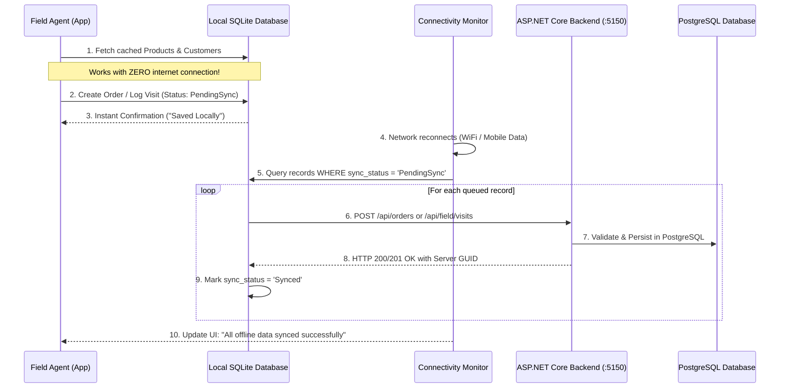
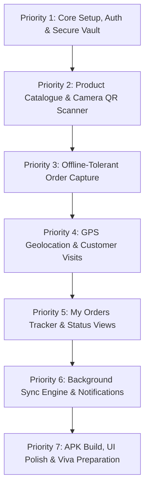

# StockFlow-AI Mobile Architecture Plan (Updated)
## Flutter Mobile Application — Field Sales & Operations Solution (SE3090 Aligned)

**Project**: SE3090 Distributed Systems & SME Inventory Management  
**Platform**: Flutter 3.x (Android & iOS)  
**Target User Persona**: Field Sales Officers / Field Agents (`UserRole.FieldSales`)  
**Backend API Target**: `http://localhost:5150/api` (Android Emulator: `http://10.0.2.2:5150/api` | Physical Device: LAN IP)  
**Core Architectural Principles**: **Offline-Tolerant** + **Hardware Device Features (QR/Barcode & GPS)** + **Secure JWT Vault**  
**Date**: September 2026  

---

## 🎯 Executive Summary & Platform Distinction

In the **StockFlow-AI** SME platform architecture, the **React Web App** and the **Flutter Mobile App** serve distinctly different, complementary roles as specified in the SE3090 Project Brief:

* 🖥️ **React Web App (Office / Supervisory Desk)**:
  * Used by **Administrators** and **Warehouse Managers**.
  * Focused on system configuration, ERP order desk, stock replenishment, and the **Component D Human-in-the-Loop AI Reorder Approval Gate**.
* 📱 **Flutter Mobile App (Field Ground Operations)**:
  * Used exclusively by **Field Sales Staff / Field Agents**.
  * Focused on field mobility: on-ground customer visits, GPS check-ins, instant barcode/QR catalog lookups, offline-tolerant customer order capture, and dispatch notifications.

```
┌─────────────────────────────────────────────────────────────────────────────┐
│                       CROSS-PLATFORM INTEGRATION FLOW                       │
└─────────────────────────────────────────────────────────────────────────────┘

  📱 Flutter Mobile (Field Agent)
      │
      ├─► 1. Auto GPS Check-in & Customer Visit Recording
      ├─► 2. Hardware Camera QR / Barcode Scan for Stock Verification
      ├─► 3. Captures Customer Sales Order (Offline-Tolerant Queue)
      │
      ▼ (HTTP REST / JWT Bearer)
  🌐 ASP.NET Core Web API (Backend at :5150)
      │
      ├─► 4. Persists Orders, Visits & Device Captures into PostgreSQL
      ├─► 5. Stock level drops below threshold -> Triggers Component D Agentic Pipeline
      │
      ▼
  🖥️ React Web Application (Warehouse Manager)
      │
      └─► 6. Reviews AI Reorder Proposal -> Manager Human-in-the-Loop Approves
      │
      ▼ (Notification Trigger)
  📱 Flutter Mobile Notification
      └─► 7. Field Agent receives instant Order Confirmation & Restock Status Alert
```

---

## 📋 SE3090 Brief Alignment: Mandatory vs Non-Mandatory Scope

To guarantee rapid delivery, zero bloat, and maximum exam grading marks, the mobile application strictly isolates **mandatory field features** from office-only features:

### ✅ Mandatory Mobile Features (Must Implement)
| Feature | Project Brief Section | Reason & Architectural Evidence |
|---|---|---|
| **Secure Login & JWT Storage** | Section 6 (Security) | Role-based token storage using device secure hardware keychain |
| **Product Search & Stock Lookup** | Component A | On-ground visibility of warehouse inventory before booking orders |
| **Hardware QR / Barcode Scanner** | Section 9 (Device Feature) | Meaningful camera hardware utilization for instant SKU identification |
| **Offline-Tolerant Order Capture** | Component B & Section 9 | Booking multi-line orders at retail stores with local SQLite caching |
| **GPS Geolocation Capture** | Component C (Field Ops) | Device GPS hardware capture during customer check-in and delivery |
| **Customer Lookup & Visit Logging** | Component C (Field Ops) | Recording field visits, check-in/out timestamps, and customer notes |
| **Order Status & Tracking List** | Component B | Full visibility of orders submitted by the agent and their lifecycle |
| **Alerts & In-App Notifications** | Component D Surface | Real-time notifications for order confirmation, low stock & restock |

### ❌ Non-Mandatory on Mobile (Omitted / Web-Only)
* **Full Multi-Agent Orchestration Graphs**: (Belongs on React Web Manager dashboard).
* **Manager Human-in-the-Loop Approval UI**: (Approvals are strictly manager office duties on Web).
* **Complex BI / Velocity Heatmaps**: (Excessive mobile memory footprint; belongs on Web reports).
* **Admin User CRUD & System Configuration**: (Admin management is strictly desktop-focused).

---

## 🏛️ Clean Mobile Architecture

```
StockFlow Mobile (Flutter)
│
├── 1. Authentication & Security
│   ├── JWT Authentication (`/api/auth/login`)
│   ├── Hardware Keystore Token Storage (`flutter_secure_storage`)
│   └── Auto Token Refresh & Session Expiry Interceptors
│
├── 2. Product Catalogue & Barcode Scanner
│   ├── Fast Cached Product Search & SKU Lookup
│   ├── Real-time Stock Display (On-hand vs Available)
│   └── Camera QR / Barcode Scanner (`mobile_scanner`)
│
├── 3. Orders & Field Sales Desk
│   ├── 3-Step Create Order Flow (Customer ➔ Products ➔ Review)
│   ├── Multi-Line Item Basket with Live Total Calculation
│   └── "My Orders" Tracker with Status Badges (Pending, Confirmed, Dispatched)
│
├── 4. Customer CRM & GPS Field Visits
│   ├── Retail Customer Directory with Geocoded Locations
│   ├── GPS Auto Location Capture (`geolocator`)
│   └── Start / End Visit Recording with Outcome Notes
│
├── 5. Offline Engine & Data Synchronization
│   ├── Local SQLite / Hive Cache for Products & Customers
│   ├── Offline Operations Queue (Pending Orders & Captures)
│   └── Connectivity Auto-Sync Listener (`connectivity_plus`)
│
└── 6. Notifications & Status Alerts
    ├── Order Fulfillment & Confirmation Alerts
    └── Critical Low-Stock Warning Notifications
```

---

## 📁 Recommended Folder Structure

```
mobile/
├── android/
├── ios/
├── assets/
│   ├── icons/
│   └── images/
│
├── lib/
│   ├── main.dart                   # App entry point & DI initialization
│   │
│   ├── core/                       # Core Infrastructure & Cross-Cutting
│   │   ├── config/
│   │   │   └── api_config.dart     # Dynamic Base URL (Emulator vs LAN vs Prod)
│   │   ├── theme/
│   │   │   ├── app_theme.dart      # Material 3 Design Tokens (Light & Dark)
│   │   │   └── app_colors.dart     # Brand Palettes (Navy, Emerald, Coral, Slate)
│   │   ├── network/
│   │   │   ├── api_client.dart     # Dio instance with JWT interceptors
│   │   │   └── error_handler.dart  # User-friendly network exception messages
│   │   └── storage/
│   │       ├── secure_vault.dart   # flutter_secure_storage wrapper
│   │       └── local_database.dart # SQLite database helper for offline queue
│   │
│   ├── features/                   # Domain Feature Modules
│   │   │
│   │   ├── auth/                   # Identity & Session Management
│   │   │   ├── models/user_session.dart
│   │   │   ├── providers/auth_provider.dart
│   │   │   └── screens/
│   │   │       ├── splash_screen.dart
│   │   │       └── login_screen.dart
│   │   │
│   │   ├── home/                   # Officer Home Dashboard
│   │   │   └── screens/home_dashboard_screen.dart
│   │   │
│   │   ├── products/               # Component A: Product & Inventory
│   │   │   ├── models/product_model.dart
│   │   │   ├── providers/products_provider.dart
│   │   │   └── screens/
│   │   │       ├── product_list_screen.dart
│   │   │       ├── product_detail_screen.dart
│   │   │       └── qr_scanner_screen.dart  # Hardware camera scanner
│   │   │
│   │   ├── orders/                 # Component B: Field Order Capture
│   │   │   ├── models/order_models.dart
│   │   │   ├── providers/orders_provider.dart
│   │   │   └── screens/
│   │   │       ├── create_order_screen.dart  # 3-step order wizard
│   │   │       ├── my_orders_screen.dart
│   │   │       └── order_detail_screen.dart
│   │   │
│   │   ├── visits/                 # Component C: Field Visits & GPS
│   │   │   ├── models/visit_models.dart
│   │   │   ├── providers/visits_provider.dart
│   │   │   └── screens/
│   │   │       ├── customer_list_screen.dart
│   │   │       ├── start_visit_screen.dart   # Auto GPS acquisition
│   │   │       └── visit_history_screen.dart
│   │   │
│   │   └── notifications/          # Alerts & Messaging
│   │       ├── models/notification_model.dart
│   │       ├── providers/notification_provider.dart
│   │       └── screens/notifications_screen.dart
│   │
│   ├── shared/                     # Reusable UI Widgets & Utilities
│   │   ├── widgets/
│   │   │   ├── custom_button.dart
│   │   │   ├── custom_text_field.dart
│   │   │   ├── status_badge.dart
│   │   │   ├── offline_status_banner.dart
│   │   │   └── loading_overlay.dart
│   │   └── utils/
│   │       ├── currency_formatter.dart  # Rs. format (LKR)
│   │       └── date_formatter.dart
│   │
│   └── services/                   # Backend API Communication
│       ├── auth_service.dart       # /api/auth/*
│       ├── product_service.dart    # /api/products/*
│       ├── order_service.dart      # /api/orders/*
│       ├── field_service.dart      # /api/field/*
│       └── sync_service.dart       # Background offline queue replay engine
│
├── pubspec.yaml
└── README.md
```

---

## 📱 Detailed Screen Specifications (Must-Build)

### 1. Authentication & Security
* **`SplashScreen`**:
  * Checks hardware secure storage for an existing JWT token.
  * If valid, validates expiry and auto-navigates to `HomeDashboardScreen`; otherwise navigates to `LoginScreen`.
* **`LoginScreen`**:
  * Clean, high-contrast Material 3 login card.
  * Form inputs: Email address, Password, with show/hide password toggle.
  * **One-Tap Demo Login Button**:
    * 🚀 Quick fill for Field Officer: `officer@stockflow.ai` / `Officer@123`
  * Saves JWT token and user profile into `flutter_secure_storage`.

### 2. Home Dashboard (`HomeDashboardScreen`)
* **Officer Welcome Header**:
  * Officer name, Assigned Route/Region (e.g. *Western Province*), and Connection Status Pill (🟢 Online | 🟠 Offline Mode).
* **Today's Metric Summary Cards**:
  * 📋 *Visits Today*: Total completed customer check-ins.
  * 🛒 *Orders Booked*: Count of sales orders placed today.
  * 💰 *Order Value (LKR)*: Total revenue generated today.
* **Quick Action Buttons**:
  * 📷 **Scan Product** (Launches Camera QR Scanner).
  * ➕ **New Sales Order** (Opens Order Wizard).
  * 📍 **Start Customer Visit** (Acquires GPS & launches check-in).

### 3. Products & Hardware Scanner
* **`ProductListScreen`**:
  * Instant search bar filtering by Product Name or SKU.
  * Category chips filter (`All`, `Beverages`, `Dairy`, `Staples`, `Snacks`).
  * List Card: Product Name, SKU, Category, Unit Price, and Real-time Stock Badge (e.g. `120 In Stock` vs `3 Low Stock`).
* **`ProductDetailScreen`**:
  * Full specification: SKU, Barcode, Cost/Unit Price, Available Quantity, Minimum Safety Threshold.
* **`QrScannerScreen`**:
  * Uses `mobile_scanner` with overlay viewfinder and flashlight toggle.
  * Instantly scans 1D Barcode (EAN-13/UPC) or 2D QR Code.
  * Automatically resolves product from local cache or API and opens `ProductDetailScreen` or adds directly to the active order basket.

### 4. Field Orders Desk
* **`CreateOrderScreen` (3-Step Wizard)**:
  * **Step 1 — Select Customer**: Choose from geocoded customer directory.
  * **Step 2 — Add Line Items**: Pick products, enter quantities, adjust discounts, verify on-hand stock availability.
  * **Step 3 — Order Summary & Review**: Subtotal, taxes, delivery address, optional special delivery instructions.
  * **Offline Resilience**: If connectivity is unavailable, saves the order into local SQLite queue with status `PendingSync` and alerts the user with an *"Order Saved Offline"* banner.
* **`MyOrdersScreen`**:
  * Filter tabs: `All`, `Pending`, `Confirmed`, `Dispatched`, `Fulfilled`.
  * Order Card: Customer Name, Order Date, Total Amount, Sync Status (Synced / Queued), and Lifecycle Badge.
* **`OrderDetailScreen`**:
  * Breakdown of ordered products, quantities, prices, delivery coordinates, and current fulfillment status.

### 5. Customers & GPS Field Visits
* **`CustomerListScreen`**:
  * Searchable retailer directory with phone number and address.
  * Tap customer to view past orders or start a new visit.
* **`StartVisitScreen`**:
  * Automatically requests device GPS permissions using `geolocator`.
  * Captures live Latitude, Longitude, and GPS Accuracy.
  * Visit Timer (Clock in / Clock out).
  * Check-out notes form (e.g. *"Store shelf audited, restock requested, payment collected"*).
* **`VisitHistoryScreen`**:
  * Chronological diary of past visits completed by the field officer.

### 6. Notifications Screen (`NotificationsScreen`)
* In-app notification inbox:
  * 🔔 Order Confirmation alerts.
  * ⚠️ Low Stock alerts for critical SKUs.
  * 📦 Reorder fulfillment updates.

---

## 🧰 Mobile Technical Stack & Packages

| Category | Package | Version | Justification |
|---|---|---|---|
| **State Management** | **`flutter_riverpod`** | `^2.5.1` | Compile-safe, testable, no BuildContext dependency for business logic |
| **Networking** | **`dio`** | `^5.4.3` | Interceptors for auto JWT Bearer headers, timeout control, request retries |
| **Secure Vault** | **`flutter_secure_storage`** | `^9.2.2` | Encrypted hardware storage (Android Keystore / iOS Keychain) for tokens |
| **QR / Barcode Scanner** | **`mobile_scanner`** | `^5.1.1` | Native hardware camera scanner, ultra-fast 1D barcode and 2D QR decoding |
| **GPS Geolocation** | **`geolocator`** | `^12.0.0` | High-accuracy GPS coordinates, background permission handling |
| **Local Database** | **`sqflite`** | `^2.3.3` | Lightweight relational SQLite engine for offline product cache & order queue |
| **Connectivity** | **`connectivity_plus`** | `^6.0.3` | Real-time network state monitoring (WiFi, Mobile Data, Offline) |
| **UI Design System** | **Flutter Material 3** | SDK 3.x | Modern UI components, responsive typography, adaptive elevation |

---

## 🔄 Offline Engine & Synchronization Workflow

The SE3090 brief explicitly highlights offline tolerance for field operations. The mobile application implements an **Offline-First Queue Engine**:



### Local SQLite Schema (`stockflow_offline.db`):
1. **`cached_products`**: `id`, `sku`, `name`, `unit_price`, `stock_available`, `category`, `last_synced_at`
2. **`cached_customers`**: `id`, `name`, `phone`, `address`, `city`, `latitude`, `longitude`
3. **`offline_orders_queue`**: `local_id`, `customer_id`, `lines_json`, `total_amount`, `notes`, `created_at`, `sync_status`
4. **`offline_visits_queue`**: `local_id`, `customer_id`, `latitude`, `longitude`, `notes`, `created_at`, `sync_status`

---

## 🚀 Mobile Implementation Priority Roadmap



### Phase 1: Core Foundation (Day 1)
* Initialize Flutter project (`flutter create --org com.stockflow mobile`).
* Configure `Dio` HTTP client with Base URL and token interceptors.
* Implement `flutter_secure_storage` vault for JWT token caching.
* Build `SplashScreen` and `LoginScreen` with one-tap demo credentials (`officer@stockflow.ai` / `Officer@123`).

### Phase 2: Hardware QR Scanner & Products (Day 2)
* Implement `ProductService` connecting to `/api/products`.
* Build `ProductListScreen` with category chips and live search.
* Build `QrScannerScreen` integrating `mobile_scanner` camera viewfinder.
* Implement barcode-to-product lookup.

### Phase 3: Field Order Creation (Day 3)
* Build `CreateOrderScreen` multi-step form (Customer selection ➔ Line items ➔ Review).
* Compute dynamic order totals (quantity × unit price).
* Connect to `POST /api/orders`.

### Phase 4: GPS & Field Operations (Day 4)
* Implement `FieldService` connecting to `/api/field/*`.
* Integrate `geolocator` to acquire device GPS coordinates.
* Build `StartVisitScreen` and `VisitHistoryScreen`.
* Connect check-ins to `POST /api/field/visits`.

### Phase 5: Offline Queue & Sync Engine (Day 5)
* Implement `sqflite` database helper.
* Cache products and customers locally.
* Intercept order creation when offline: save to SQLite queue.
* Implement `SyncService` that triggers on network restore.

### Phase 6: Polish & Cross-Platform Demo Testing (Day 6)
* Connect in-app notification feed.
* Test full round-trip: Mobile order creation ➔ Backend agent trigger ➔ Web manager approval ➔ Mobile restock alert.
* Build release APK for viva demonstration.

---

## 🎓 Viva Presentation & Examiner Defense Guide

During project defense, present the Flutter mobile application using this winning demonstration sequence:

1. **Hardware Device Feature Demonstration (Camera & Scanner)**:
   * Open `QrScannerScreen`. Scan a sample product barcode or QR code.
   * Show the app instantaneously resolving the product name, price, and current warehouse stock level.
   * *Examiner Point*: Proves real device camera hardware integration beyond simple web wrappers.

2. **GPS Geolocation Field Check-in**:
   * Open `StartVisitScreen` for a customer (e.g. *City Supermarket Colombo 03*).
   * Tap **"Check In"** and show live GPS coordinates (Latitude/Longitude) acquired from the device sensor.
   * *Examiner Point*: Validates Component C field visit compliance and verification.

3. **Offline-Tolerant Order Capture**:
   * Switch the device to **Airplane Mode (No Internet)**.
   * Book an order for 2 products and tap **"Submit Order"**.
   * Show the app smoothly accepting the order with an **"Order Saved Offline (Pending Sync)"** status badge.
   * Turn **Airplane Mode OFF**. Show the background sync engine automatically transmitting the order to the ASP.NET Core backend.
   * Open pgAdmin or the React Web App to prove the order arrived in PostgreSQL.

4. **Cross-Platform Workflow Climax**:
   * Show how an order booked on mobile causes inventory to drop below threshold.
   * Switch to the React Web App to show the **AI Reorder Proposal** automatically appearing for the manager to approve!
